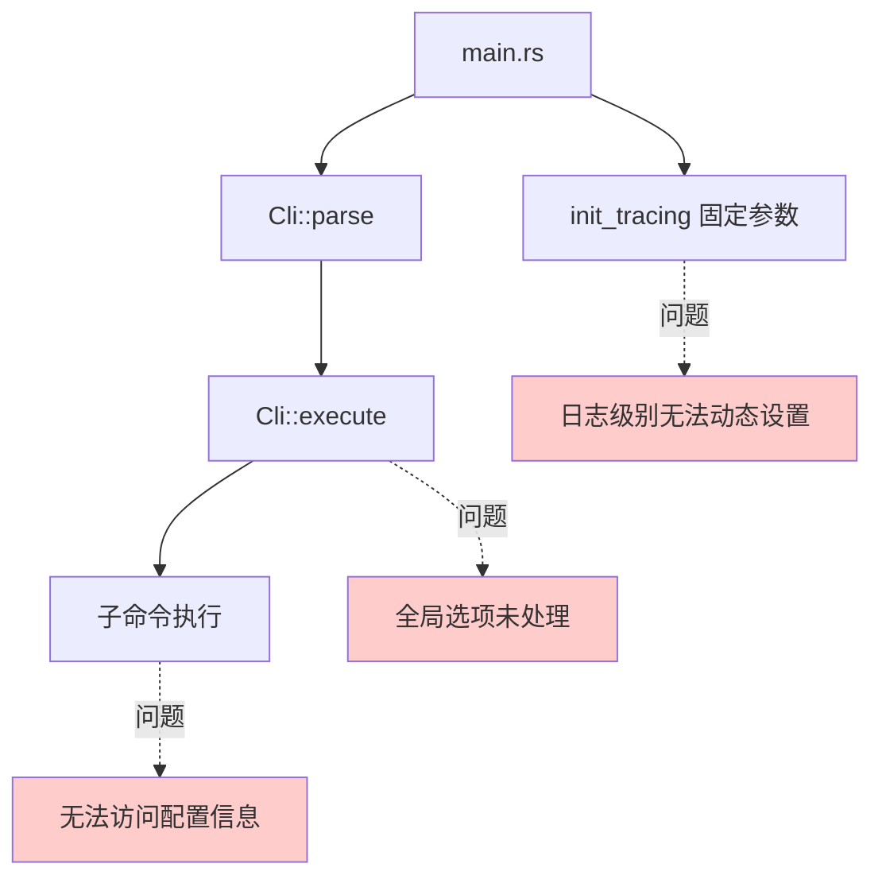
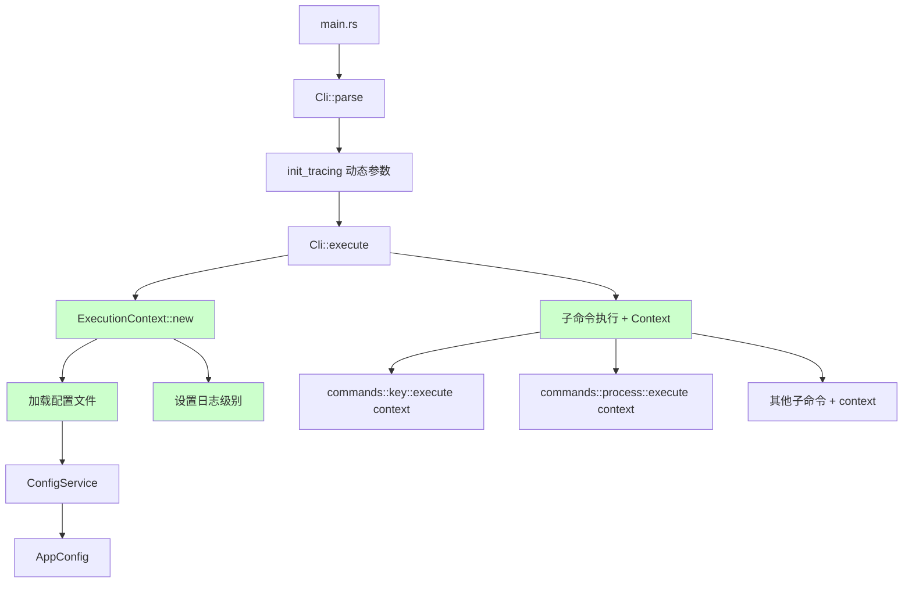
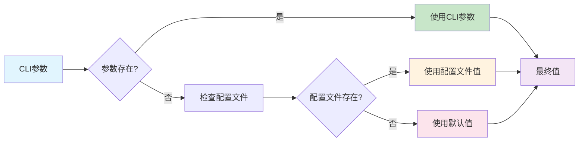
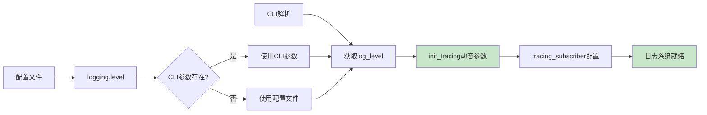
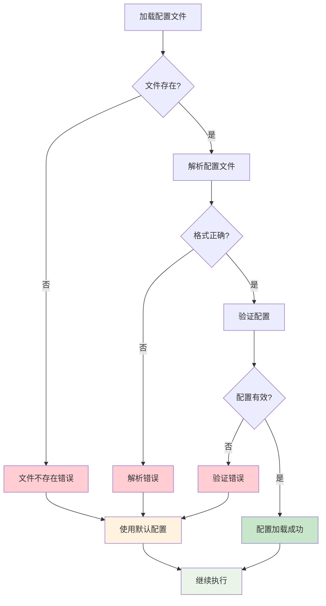
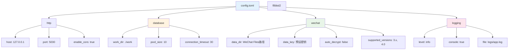
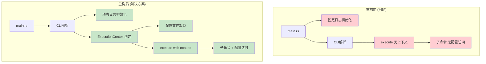
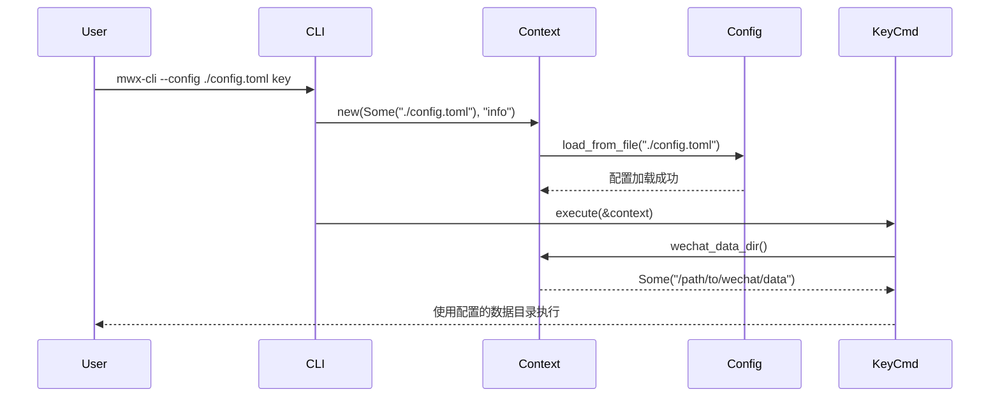
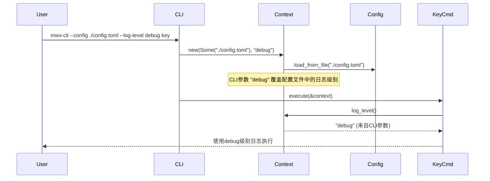
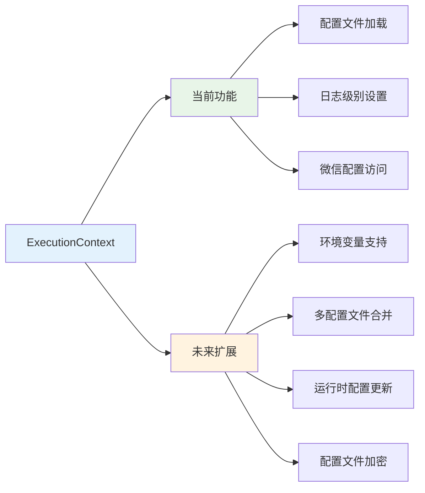

# CLI Options 架构设计图

## 当前架构问题



## 重构后架构



## 执行上下文架构

```mermaid
classDiagram
    class ExecutionContext {
        -config_service: Option~ConfigService~
        -log_level: String
        -default_config: AppConfig
        +new(config_path, log_level) ExecutionContext
        +config() &AppConfig
        +log_level() &str
        +wechat_data_dir() Option~Path~
        +wechat_data_key() Option~str~
    }
    
    class ConfigService {
        -config: AppConfig
        -config_path: Option~PathBuf~
        +load_from_file(path) ConfigService
        +config() &AppConfig
        +update_config(f) Result
        +save() Result
    }
    
    class AppConfig {
        +http: HttpConfig
        +database: DatabaseConfig
        +wechat: WeChatConfig
        +logging: LoggingConfig
        +from_file(path) AppConfig
        +validate() Result
    }
    
    ExecutionContext --> ConfigService : contains
    ConfigService --> AppConfig : manages
    
    note for ExecutionContext : "统一的执行上下文\n传递给所有子命令"
    note for ConfigService : "配置文件管理\n支持加载和保存"
    note for AppConfig : "应用配置结构\n包含所有设置项"
```

## 配置优先级流程



## 子命令执行流程

```mermaid
sequenceDiagram
    participant Main as
main.rs
    participant CLI as Cli
    participant Context as ExecutionContext
    participant Config as ConfigService
    participant Cmd as SubCommand
    
    Main->>CLI: parse()
    Main->>Main: init_tracing(log_level)
    Main->>CLI: execute()
    
    CLI->>Context: new(config_path, log_level)
    Context->>Config: load_from_file() [if config_path]
    Config-->>Context: ConfigService
    Context-->>CLI: ExecutionContext
    
    CLI->>Cmd: execute(&context)
    Cmd->>Context: config()
    Context-->>Cmd: &AppConfig
    Cmd->>Context: wechat_data_dir()
    Context-->>Cmd: Option<Path>
    Cmd-->>CLI: Result<()>
    CLI-->>Main: Result<()>
    
    Note over Context: 统一的配置访问点
    Note over Config: 配置文件管理
    Note over Cmd: 所有子命令都接收context
```

## 日志系统重构



## 错误处理流程



## 配置文件结构



## 实现对比

### 重构前 vs 重构后



## 使用场景示例

### 场景1：使用配置文件


### 场景2：命令行参数覆盖


## 扩展性设计



---

这
个架构设计确保了：

1. **清晰的职责分离** - 每个组件有明确的职责
2. **灵活的配置管理** - 支持多种配置方式和优先级
3. **统一的上下文传递** - 所有子命令都能访问配置信息
4. **良好的扩展性** - 易于添加新功能和配置选项
5. **完善的错误处理** - 优雅处理各种异常情况

通过这个架构，CLI Options 的实现将更加健壮和用户友好。