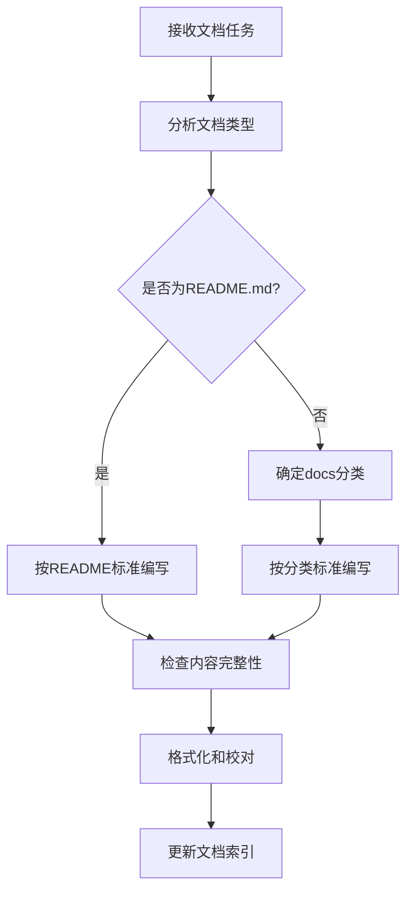
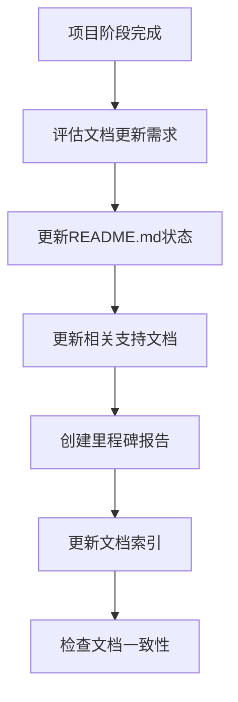

# 文档标准化指南

本文档定义了MwXdump项目的文档组织和编写标准，确保文档的一致性和可维护性。

## 📋 文档组织规则

### 1. README.md（项目根目录）
**用途**: 项目总结文档  
**位置**: 项目根目录  
**内容要求**:
- 项目的基础功能介绍
- 使用场景说明
- 如何构建与运行
- 当前项目状态
- 下一步计划

**禁止内容**:
- 详细的技术实现细节
- 完整的API文档
- 详细的架构设计
- 历史变更记录

### 2. docs/目录结构
**用途**: 所有支持类文档的存放位置  
**组织原则**: 按文档类型进行分类

#### 文档分类标准
```
docs/
├── README.md                    # 文档索引（必需）
├── documentation-standards.md   # 本标准文档
├── 架构设计文档/
│   ├── architecture-design.md
│   ├── phase2-architecture.md
│   └── cli-options-architecture.md
├── 项目规划文档/
│   ├── phase2-plan.md
│   ├── phase2-roadmap.md
│   └── *-implementation-plan.md
├── 进展报告文档/
│   ├── milestone-report.md
│   ├── phase2-progress.md
│   └── *-completion.md
└── 技术分析文档/
    ├── decrypt-analysis.md
    └── *-analysis.md
```

### 3. 文档更新时机
**阶段完成更新规则**:
1. **项目阶段完成后** - 更新README.md中的当前状态和下一步计划
2. **里程碑达成后** - 创建或更新里程碑报告文档
3. **架构变更后** - 更新相关的架构设计文档
4. **新功能完成后** - 更新功能说明和使用指南

## 📝 文档编写标准

### Markdown格式规范
1. **标题层次**
   ```markdown
   # 一级标题（文档标题）
   ## 二级标题（主要章节）
   ### 三级标题（子章节）
   #### 四级标题（详细内容）
   ```

2. **代码块格式**
   ```markdown
   # 行内代码
   使用 `code` 格式

   # 代码块
   ```rust
   fn main() {
       println!("Hello, world!");
   }
   ```
   ```

3. **链接格式**
   ```markdown
   # 相对链接（推荐）
   [文档名称](./path/to/document.md)
   
   # 绝对链接（外部资源）
   [外部链接](https://example.com)
   ```

4. **列表格式**
   ```markdown
   # 无序列表
   - 项目1
   - 项目2
     - 子项目2.1
     - 子项目2.2

   # 有序列表
   1. 第一步
   2. 第二步
   3. 第三步

   # 任务列表
   - [x] 已完成任务
   - [ ] 待完成任务
   ```

### 内容组织规范
1. **文档结构**
   - 清晰的标题和目录
   - 逻辑性强的章节划分
   - 适当的代码示例和图表

2. **语言风格**
   - 使用简洁明了的中文
   - 技术术语保持一致性
   - 避免过于口语化的表达

3. **版本信息**
   - 包含文档创建/更新日期
   - 标注文档版本或对应的项目版本
   - 记录主要变更历史

## 🔄 Documentation Writer模式工作流程

### 1. 文档创建流程


### 2. 文档更新流程


### 3. 质量检查清单
- [ ] 文档分类正确
- [ ] 格式符合Markdown规范
- [ ] 链接有效且使用相对路径
- [ ] 代码块语法高亮正确
- [ ] 内容逻辑清晰
- [ ] 无拼写和语法错误
- [ ] 文档索引已更新

## 🎯 Documentation Writer模式限制

### 允许的操作
- ✅ 读取任何项目文件以获取信息
- ✅ 创建和编辑Markdown文件（.md扩展名）
- ✅ 分析代码结构和功能
- ✅ 提取技术信息用于文档编写

### 禁止的操作
- ❌ 编辑非Markdown文件
- ❌ 修改源代码
- ❌ 执行系统命令
- ❌ 访问网络资源

### 工作重点
1. **信息提取** - 从源代码中提取文档相关信息
2. **内容组织** - 按照标准化规则组织文档内容
3. **格式规范** - 确保所有文档符合Markdown格式标准
4. **索引维护** - 保持文档索引的准确性和完整性

## 📊 文档质量指标

### 完整性指标
- README.md包含所有必需章节
- docs目录结构清晰合理
- 文档索引准确完整
- 链接有效无死链

### 一致性指标
- 格式风格统一
- 术语使用一致
- 文档结构标准化
- 更新及时性

### 可用性指标
- 内容易于理解
- 导航清晰便捷
- 信息查找高效
- 维护成本低

---

**文档版本**: v1.0  
**创建日期**: 2025-06-07  
**适用范围**: MwXdump项目所有文档  
**维护者**: Documentation Writer模式