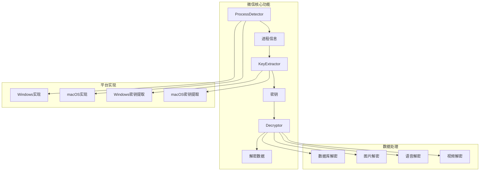
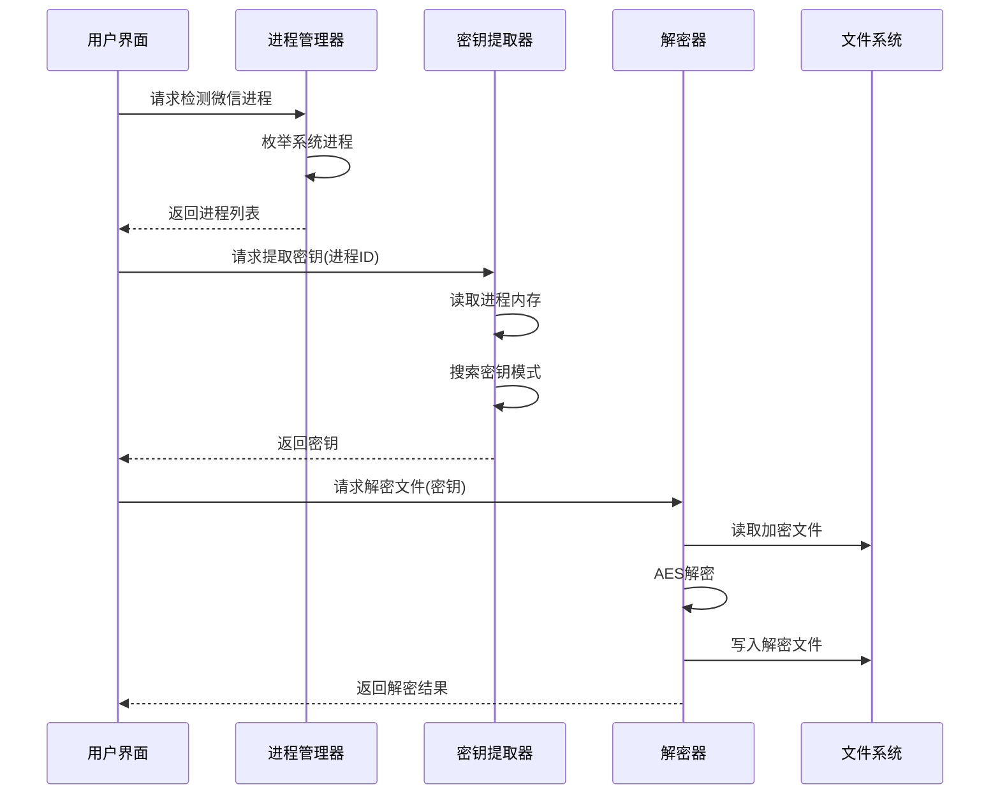

# 第二阶段架构设计

## 模块架构图



## 接口设计

### 1. 进程检测接口

```rust
// src/wechat/process/mod.rs
use async_trait::async_trait;

#[derive(Debug, Clone)]
pub struct ProcessInfo {
    pub pid: u32,
    pub name: String,
    pub path: String,
    pub version: String,
    pub data_dir: String,
}

#[async_trait]
pub trait ProcessDetector: Send + Sync {
    /// 检测所有微信进程
    async fn detect_processes(&self) -> Result<Vec<ProcessInfo>>;
    
    /// 获取进程详细信息
    async fn get_process_info(&self, pid: u32) -> Result<ProcessInfo>;
    
    /// 检测微信版本
    async fn detect_version(&self, process: &ProcessInfo) -> Result<WeChatVersion>;
}

#[derive(Debug, Clone, PartialEq)]
pub enum WeChatVersion {
    V3x { exact: String },
    V40 { exact: String },
    Unknown,
}
```

### 2. 密钥提取接口

```rust
// src/wechat/key/mod.rs
use async_trait::async_trait;
use zeroize::Zeroizing;

#[async_trait]
pub trait KeyExtractor: Send + Sync {
    /// 从进程内存中提取密钥
    async fn extract_key(&self, process: &ProcessInfo) -> Result<Zeroizing<Vec<u8>>>;
    
    /// 验证密钥是否正确
    async fn verify_key(&self, key: &[u8], test_data: &[u8]) -> Result<bool>;
}

/// 密钥信息
pub struct KeyInfo {
    pub key: Zeroizing<Vec<u8>>,
    pub version: WeChatVersion,
    pub extracted_at: DateTime<Utc>,
}
```

### 3. 解密接口

```rust
// src/wechat/decrypt/mod.rs
use async_trait::async_trait;

#[async_trait]
pub trait Decryptor: Send + Sync {
    /// 解密文件
    async fn decrypt_file(&self, input: &Path, output: &Path, key: &[u8]) -> Result<()>;
    
    /// 解密数据块
    async fn decrypt_block(&self, data: &[u8], key: &[u8]) -> Result<Vec<u8>>;
    
    /// 批量解密
    async fn decrypt_batch(&self, files: Vec<PathBuf>, key: &[u8]) -> Result<DecryptResults>;
}

pub struct DecryptResults {
    pub success: Vec<PathBuf>,
    pub failed: Vec<(PathBuf, Error)>,
    pub total_size: u64,
    pub duration: Duration,
}

/// 解密算法
pub enum DecryptAlgorithm {
    Aes128Cbc { iv: Vec<u8> },
    Custom { version: WeChatVersion },
}
```

## 数据流设计



## 错误处理策略

```rust
// src/wechat/errors.rs
#[derive(Error, Debug)]
pub enum WeChatError {
    #[error("未找到微信进程")]
    ProcessNotFound,
    
    #[error("权限不足: {0}")]
    PermissionDenied(String),
    
    #[error("不支持的微信版本: {version}")]
    UnsupportedVersion { version: String },
    
    #[error("密钥提取失败: {0}")]
    KeyExtractionFailed(String),
    
    #[error("解密失败: {0}")]
    DecryptionFailed(String),
    
    #[error("文件损坏: {path}")]
    CorruptedFile { path: PathBuf },
}
```

## 安全考虑

1. **内存安全**
   - 使用 `zeroize` 自动清理敏感数据
   - 避免密钥在内存中的不必要复制
   - 使用 `SecureString` 存储密钥

2. **权限控制**
   - 检查运行权限
   - 提供清晰的权限提升指导
   - 最小权限原则

3. **数据保护**
   - 不记录密钥到日志
   - 解密后的数据权限控制
   - 临时文件安全删除

## 性能设计

1. **并发处理**
   ```rust
   use tokio::task::JoinSet;
   
   pub async fn decrypt_files_concurrent(
       files: Vec<PathBuf>,
       key: &[u8],
       max_concurrent: usize,
   ) -> Result<DecryptResults> {
       let semaphore = Arc::new(Semaphore::new(max_concurrent));
       let mut tasks = JoinSet::new();
       
       for file in files {
           let permit = semaphore.clone().acquire_owned().await?;
           let key = key.to_vec();
           
           tasks.spawn(async move {
               let _permit = permit;
               decrypt_single_file(&file, &key).await
           });
       }
       
       // 收集结果
       let mut results = DecryptResults::default();
       while let Some(result) = tasks.join_next().await {
           match result? {
               Ok(path) => results.success.push(path),
               Err((path, err)) => results.failed.push((path, err)),
           }
       }
       
       Ok(results)
   }
   ```

2. **内存映射**
   - 大文件使用内存映射
   - 流式处理避免内存占用
   - 缓冲区复用

3. **进度反馈**
   - 实时进度更新
   - 剩余时间估算
   - 可取消的操作

## 测试计划

1. **单元测试**
   - 加密算法正确性
   - 密钥模式匹配
   - 错误处理路径

2. **集成测试**
   - 端到端解密流程
   - 不同版本兼容性
   - 性能基准测试

3. **平台测试**
   - Windows 10/11
   - macOS 12+
   - 不同微信版本