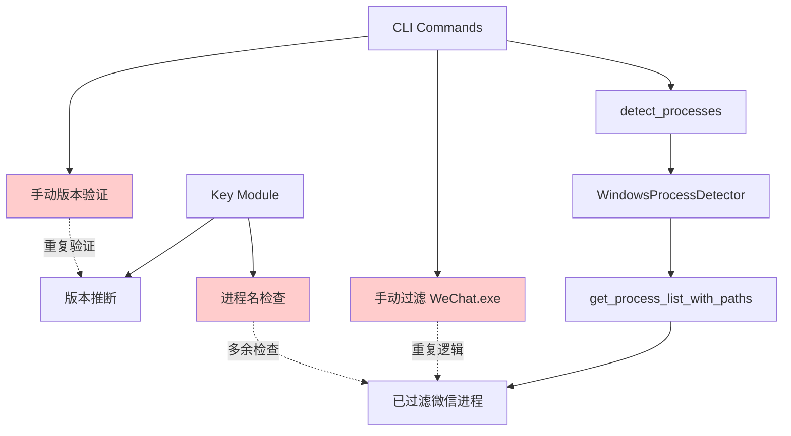
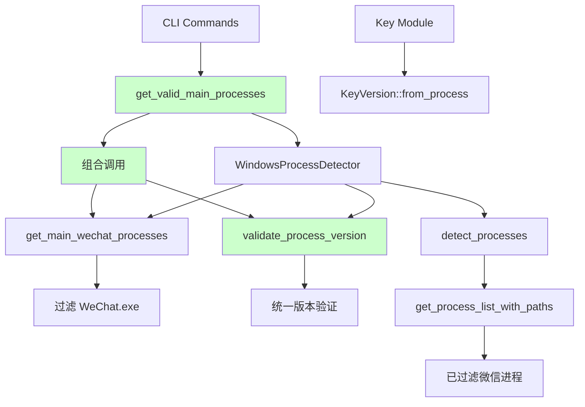
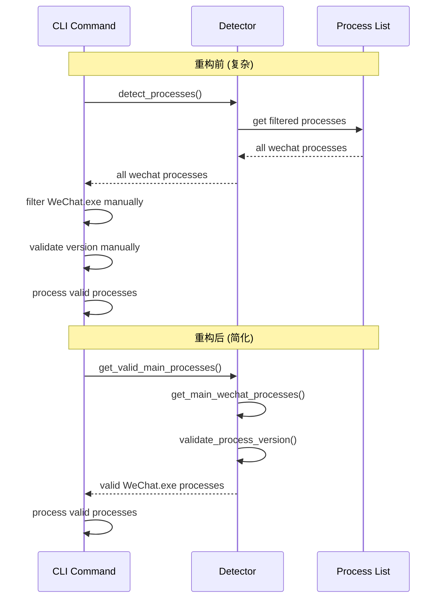
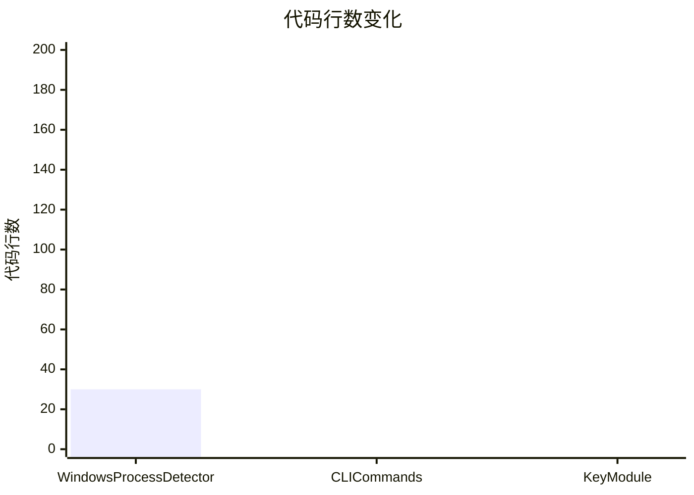
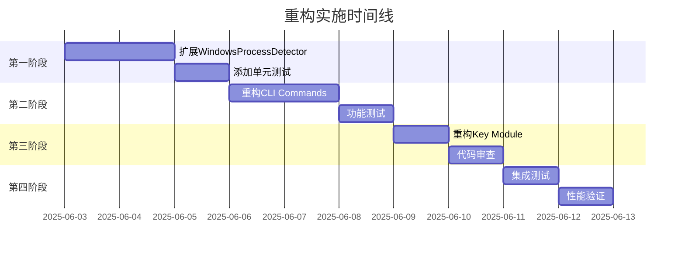
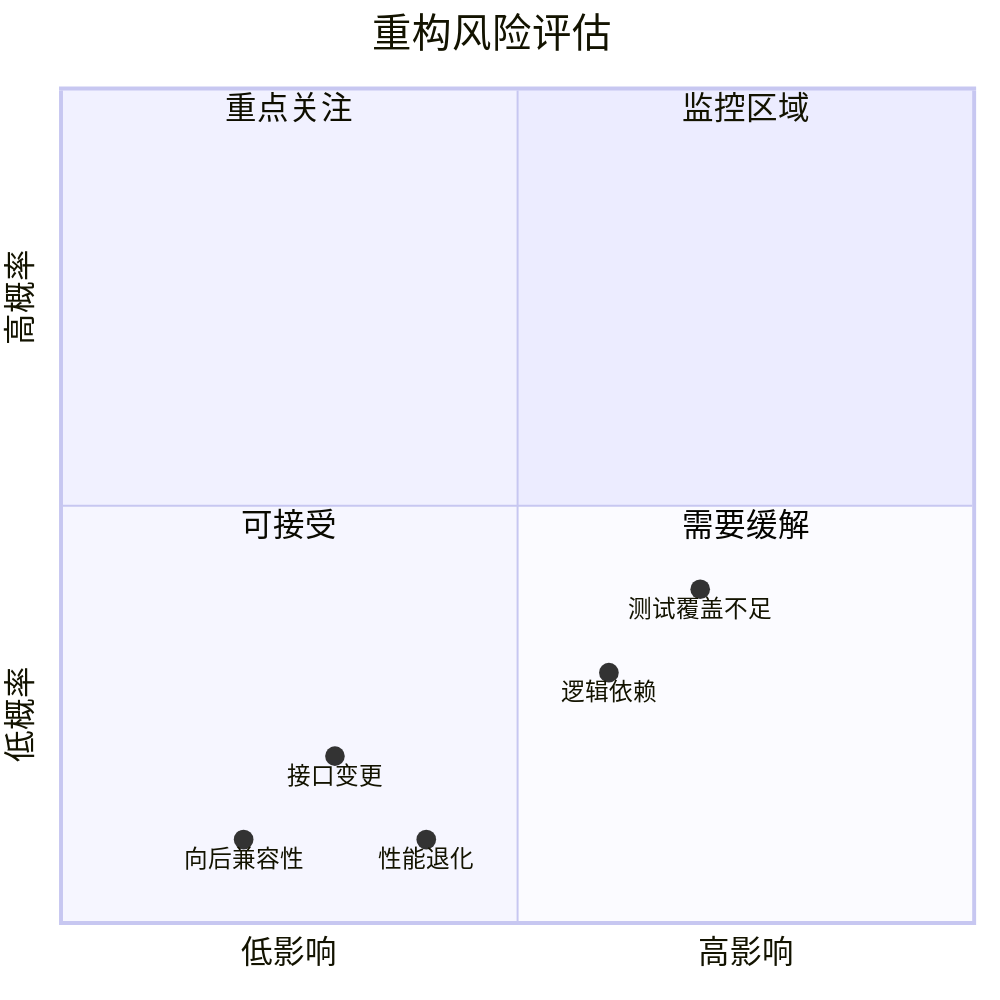
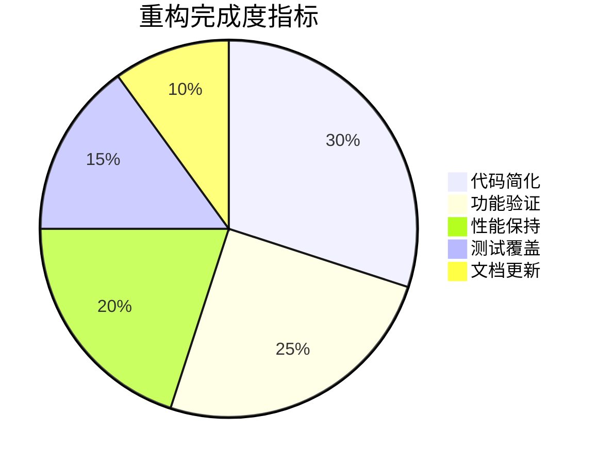

# 微信进程检测重构方案架构图

## 当前架构问题



## 重构后架构



## 重构前后对比

### 调用链简化



## 新增方法关系图

```mermaid
classDiagram
    class WindowsProcessDetector {
        -wechat_process_names: Vec~String~
        +detect_processes() Vec~ProcessInfo~
        +get_main_wechat_processes() Vec~ProcessInfo~
        +validate_process_version(process) bool
        +get_valid_main_processes() Vec~ProcessInfo~
        +get_all_wechat_processes() Vec~ProcessInfo~
    }
    
    class ProcessInfo {
        +pid: u32
        +name: String
        +path: PathBuf
        +version: WeChatVersion
        +data_dir: Option~PathBuf~
    }
    
    class WeChatVersion {
        <<enumeration>>
        V3x
        V4x
        Unknown
    }
    
    WindowsProcessDetector --> ProcessInfo : returns
    ProcessInfo --> WeChatVersion : contains
    
    note for WindowsProcessDetector : "新增的业务导向方法\n基于现有detect_processes()"
```

## 重构影响范围

```mermai
d
mindmap
  root((重构影响))
    Windows Process Detector
      添加新方法
        get_main_wechat_processes
        validate_process_version
        get_valid_main_processes
      保持兼容性
        detect_processes 不变
        现有接口保留
    CLI Commands
      简化逻辑
        移除手动过滤
        移除重复验证
      改进用户体验
        更清晰的错误信息
        更好的进度提示
    Key Module
      清理接口
        移除防御性检查
        专注版本推断
      提高可读性
        简化逻辑流程
        改进日志记录
```

## 代码行数变化预估



## 重构时间线



## 风险评估矩阵



## 成功指标仪表板



---

这些图表展示了重构方案的各个方面：
- **架构对比**: 清晰显示重构前后的差异
- **调用链简化**: 展示API使用的简化过程  
- **影响范围**: 全面了解重构涉及的模块
- **时间规划**: 合理的实施时间线
- **风险管控**: 识别和评估潜在风险
- **成功衡量**: 明确的完成标准